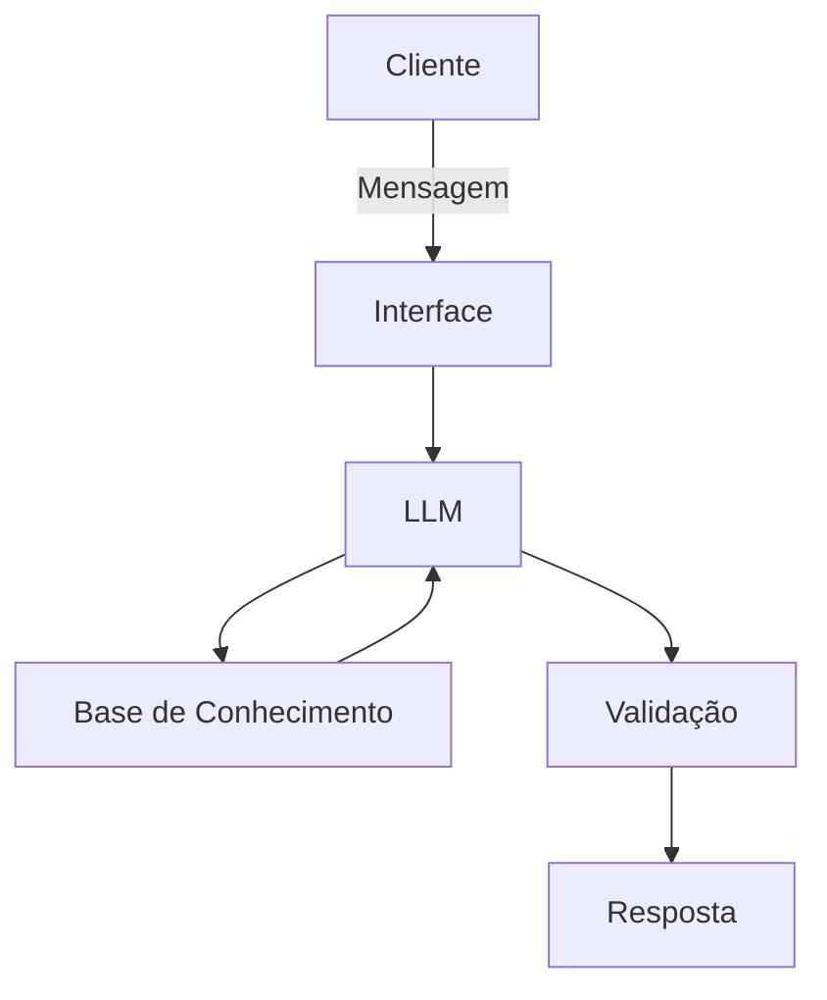

# Documentação do Agente

## Caso de Uso

### Problema
> Qual problema financeiro seu agente resolve?

O agente resolve a falta de clareza e previsibilidade no fluxo de caixa pessoal/microempresarial.

### Solução
> Como o agente resolve esse problema de forma proativa?

O agente analisa o histórico de dados persistido e antecipa cenários.

### Público-Alvo
> Quem vai usar esse agente?

Pessoas que possuem uma renda flutuante ou um orçamento mais apertado e precisam de máxima previsibilidade para tomar decisões rápidas.

## Persona e Tom de Voz

### Nome do Agente
Finco

### Personalidade
> Como o agente se comporta? (ex: consultivo, direto, educativo)

Consultivo e educativo.

### Tom de Comunicação
> Formal, informal, técnico, acessível?

Formal e acessível.

### Exemplos de Linguagem
- Saudação: [ex: "Olá! Como posso ajudar com suas finanças hoje?"]
- Confirmação: [ex: "Entendi! Deixa eu verificar isso para você."]
- Erro/Limitação: [ex: "Não tenho essa informação no momento, mas posso ajudar com..."]

---

## Arquitetura

### Diagrama

### Componentes

| Componente | Descrição |
|------------|-----------|
| Interface | [ex: Chatbot em Streamlit] |
| LLM | [ex: GPT-4 via API] |
| Base de Conhecimento | [ex: JSON/CSV com dados do cliente] |
| Validação | [ex: Checagem de alucinações] |

---

## Segurança e Anti-Alucinação

### Estratégias Adotadas

- [ ] [ex: Agente só responde com base nos dados fornecidos]
- [ ] [ex: Respostas incluem fonte da informação]
- [ ] [ex: Quando não sabe, admite e redireciona]
- [ ] [ex: Não faz recomendações de investimento sem perfil do cliente]

### Limitações Declaradas
> O que o agente NÃO faz?

- Não realiza transações financeiras reais: Ele é um ambiente de simulação e análise, não faz PIX, pagamentos ou transferências. 
- Não dá dicas de investimento de alto risco (Recomendações de Ações/Cripto): Ele se limita a simular cenários de renda fixa básicos (ex: Poupança vs. CDB) e organizar o orçamento existente. 
